# PythonPart SOM2_1Attribute

FOR ENGLISH VERSION SEE [BELOW](#SOMAttributes)!

Das PythonPart ermöglicht die Umsetzung der von der **DB InfraGO AG** gestellten Anforderungen an die Semantik, also die Alphanumerik der Objekte und Bauteile **SOM** (**S**emantic**O**bject**M**odel) in ALLPLAN. Damit lassen sich die meisten der hierfür erforderlichen Schritte mehr oder weniger automatisch ausführen:
- **Definition** der erforderlichen Attribute
- **Zuweisung** von Attributen and die relevanten Objekte
- **Erstellung** eines angepassten **Attributmapping** für den IFC Export

Ein zusätzlicher Filter erlaubt die Einschränkung des Attribute- und Objektumfangs auf das für die aktuelle **Leistungsphase** oder **UseCase** erforderliche Maß.

Basis für sämtliche Einzelschritte bilden die **Excel Dateien** **DB_InfraGO_AG_Fahrweg_SOM_2.1.1-A03.xlsx** und **DB-InfraGO-AG-Fahrweg-SOM-2-1-1_Projektanforderungen.xlsx**. Sie werden daher zusammen mit dem PythonPart zur Verfügung gestellt.

> ⚠️ACHTUNG\
Da sich der Status der Excel Dateien seit der Bereitstellung des PythonParts geändert haben kann, sollten diese immer über die offizielle Seite der **DB_InfraGO_AG** auf Aktualität überprüft werden.

## Installation

Das PythonPart **SOM2_1Attribute** lässt sich direkt über den PluginManager in ALLPLAN installieren. 

Alternativ kann die ***.allep** Datei von der zugehörigen [Release Website](https://github.com/AnkeNiedermaier/som-attributes-public/releases) direkt heruntergeladen werden. Bei ***.allep** Dateien handelt es sich um ein internes ALLPLAN Setup, das sich per Drag und Drop in das Programmfenster installieren lässt.

Voraussetzung zur Installation des PythonParts ist die ALLPLAN Version 2026.

## Installiertes PythonPart Script

Nach erfolgreicher Installation ist die Datei **SOM2_1Attribute.pyp** zusammen mit den Excel Dateien in der ALLPLAN Bibliothek zu finden:
`Std` → `Library` → `ALLPLAN GmbH` → `SOM2_1Attribute`

Das PythonParts wird neben der Bibliothek auch in einem neu angelegten Aufgabenbereich **SOM_Attributes** in der Aufgabe **Plug-in** in die ActionBar aufgenommen.

Im Gegensatz zu den anderen Dateien lassen sich die **Excel Tabellen** naträglich in einen beliebigen anderen (Unter)ordner kopieren oder verschieben.

## Erläuterung der Tabellen

Die beiden Tabellen sind generell gleich aufgebaut und enthalten alle notwendigen Parameter und Werte, die für die einzelnen Schritte notwendig sind. Die Gliederung erfolgt anhand von Gewerken und Fachrichtungen, wobei jeweils nur die Tabellenblätter mit den **Langnamen** für das PythonPart relevant sind.

### zur Attributdefinition

alle in der Spalte **Typ** mit **Eigenschaft** gekennzeichneten Zeilen enthalten eine entsprechende Definition mit den hierfür notwendigen Parametern
- Name
- Typ
- optional Einheit
- optional Werteliste

und werden, falls nicht vorhanden, beim Ausführen des PythonParts als neue benutzerdefinierte Attribute angelegt

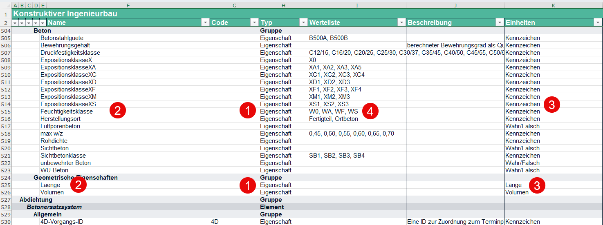 

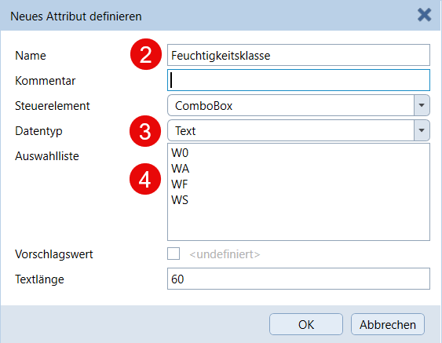
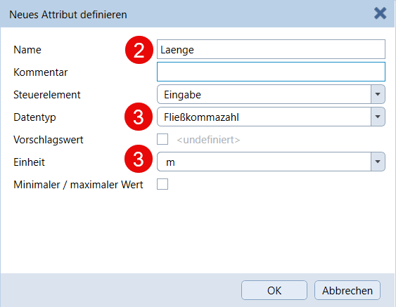 

### für die Zuweisung

die in der Spalte **Typ** mit **Element** gekennzeichneten Zeilen enthalten in der Spalte **Name** den Kenner für die Objektbezeichnung. Allen diesbezüglich klassifizierten Objekten werden die in den folgenden **Eigenschaftzeilen** aufgeführten Einträge als Attribute angehängt. In welches ALLPLAN Attribut die Objektbezeichnung eingetragen wird ist dabei frei wählbar

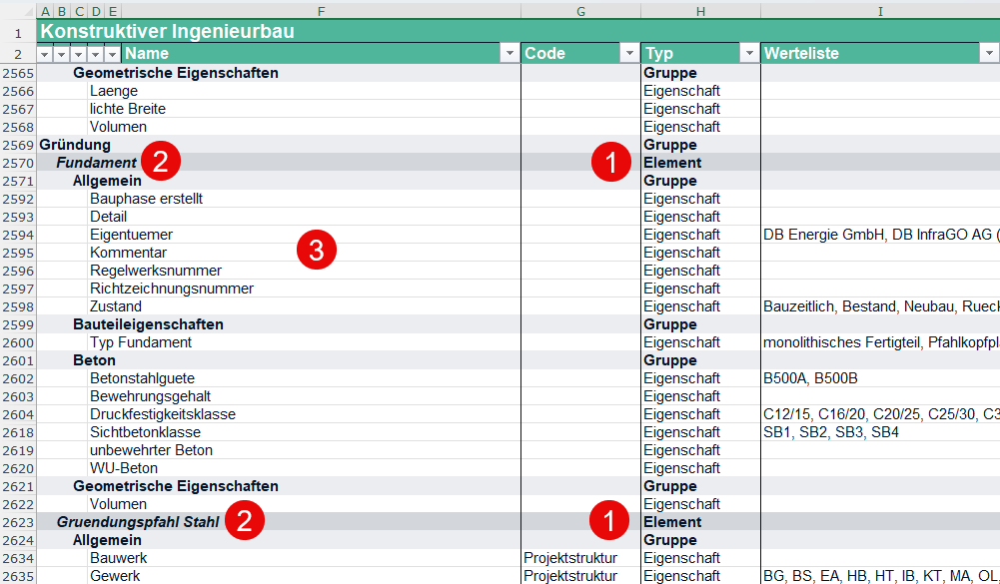 

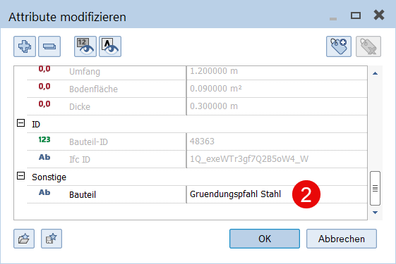
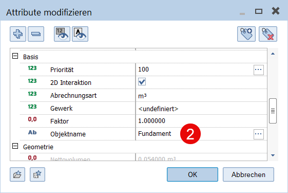 

### für die Mappingtabelle

während Attributname und -typ gleich bleiben, wird das jeweilige **PSet**, in dem die nachfolgenden **Eigenschaften** beim IFC Export zusammengefasst werden, über die in der Spalte **Typ** mit **Gruppe** gekennzeichneten Zeilen festgelegt.

Das Mapping erfolgt dabei entweder global für alle Objekte oder individuell für eine bestimmte **IfcEntity** (Klasse), je nachdem ob für das jeweilige **Element** in der Spalte **IFC 4 Add2** eine spezielle Klasse (IfcPipe, IfcFooting, ...) oder **IfcBuildingElementProxy** eingetragen ist.

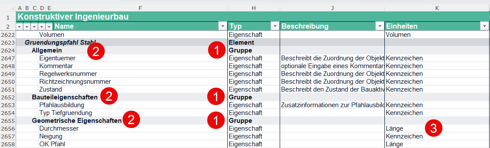 

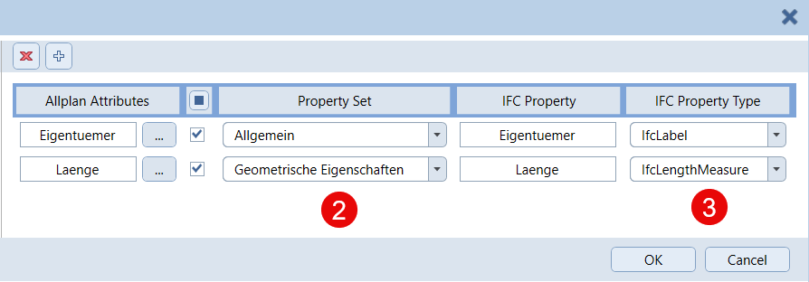 

## Workflow

Unabhängig davon, ob zusätzlich ein ActionBar Ikon erstellt wurde oder nicht, werden sämtliche installierten PythonParts in der Bibliothek abgelegt. Sie lassen sich entweder per **Doppelklick** auf den Eintrag oder **Drag und Drop** in die Zeichenfläche starten. Damit wird die zugehörige Eigenschaftenpalette eingeblendet und die hinterlegten Skripte ausgeführt.

Analog der Einzelschritte ist die Palette ebenfalls in die Bereiche
- Definition
- Zuweisung
- Mapping

sowie den übergeordneten Bereich **Allgemeine Einstellungen** aufgeteilt. Dieser ist für alle gleichermaßen gültig und dient zum **Einlesen** der **Excel Tabelle** sowie der Festlegung der aktuell zu betrachtenden **Phase** und des relvanten **Gewerkes**.

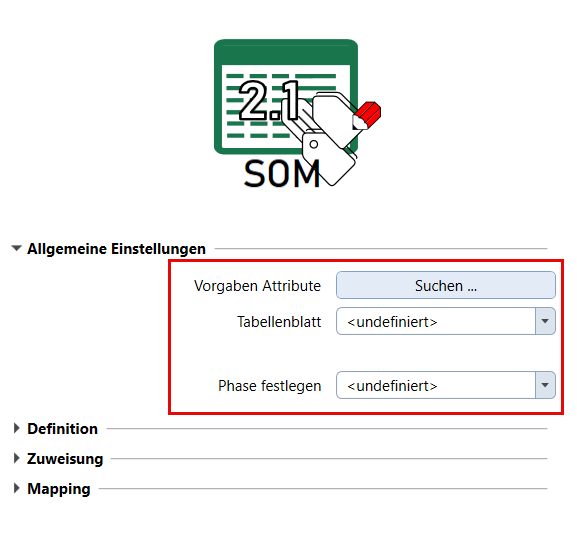 

> ⚠️ACHTUNG\
Grundsätzlich sind die einzelnen Schritte voneinander unabhängig und müssen auch nicht zwangsläufig in einem Zuge oder direkt nacheinander asugeführt werden. Die **Definition** und damit das **Anlegen der Attribute** ist allerdings zwingend notwendig, um diese anschließend **zuweisen** oder **mappen** zu können. Sie steht daher immer am Anfang.

Bevor eine **Zuweisung** an die einzelnen Modellobjekte erfolgen kann, muss diesen das ausgewählte **Kenner-Attribut** zugewiesen und darin der jeweils passende **Kenner-Wert** (Elementname) eingetragen werden. Durch einen Klick auf die Schaltfläche Objekte **wählen** wird der allgemeine Auswahldialog von ALLPLAN gestartet. In diesem stehen sämtliche Selektionsmöglichkeiten wie Bereichseingabe oder Filter zur Verfügung. Anschließend wird die Zuweisung durch einen Klick auf die gleichnamige Schaltfläche gestartet.

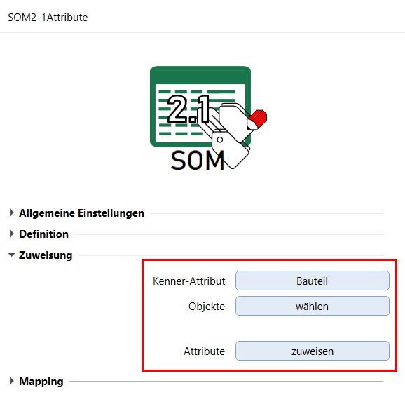 

# SOMAttributes

The PythonPart enables the implementation of the requiremtes from **DB InfraGO AG** (German Railway Sytem) for the semantic, that means the alphanumeric, of objects and building components, the so called **SOM** (**S**emantic**O**bject**M**odel) in ALLPLAN. Most of the necessary steps can be executed more or less automatically:
- **define** the required attributes
- **assign** attributes to dedicated objects
- **create** an adapted **mapping table** for the IFC export

An additional filter allows the adoption of the attributes to the range needed for the current **project phase** or **UseCase**.

The **Excel files** **DB_InfraGO_AG_Fahrweg_SOM_2.1.1-A03.xlsx** and **DB-InfraGO-AG-Fahrweg-SOM-2-1-1_Projektanforderungen.xlsx** serve as Basis for the individual steps. Therefor they are also delivered with the PythonPart.

> ⚠️IMPORTANT\
As the status of the Excel file might have been changed since the PythonPart has been published or installed, it should always be checked for Updates on the official **DB_InfraGO_AG** site.

## Installation

The PythonPart **SOM2_1Attribute** can be installed directly from the PluginManager in ALLPLAN. 

Alternatively, the corresponding ***.allep** package can be downloaded from the [release page](https://github.com/AnkeNiedermaier/som-attributes-public/releases). ***.allep** files are ALLPLAN internal setups that can be installed via drag and drop into the program window.

At least the version 2026 is needed to install the PythonPart.

## Installed PythonPart Scripts

If the installation was successfull, the PythonPart **SOM2_1Attribute.pyp** can be found
in the ALLPLAN Library:
`Office` → `Library` → `ALLPLAN GmbH` → `SOM2_1Attribute`

Besides the library, the PythonPart can also be found in the ActionBar in a newly created task area **SOM_Attributes** inside the task **Plug-ins**.

Whereas the location of all other files has to be kept, the **Excel tables** can arbitrary be copied or moved into other folders.

## Explanation of the table

In general both tables are ordered identically and contain all relevant parameters and values necessary for the individual steps. They are structured based on trades or disciplines, in which only sheets with **long names** are relevant for the PythonPart.

### for attribute definition

all rows marked with **Eigenschaft** in the **Typ** column contain a definition with its necessary parameters

- Name
- Typ
- optional Einheit
- optional Werteliste

and are created as new userdefined attributes, as long as the do not exist already.

 

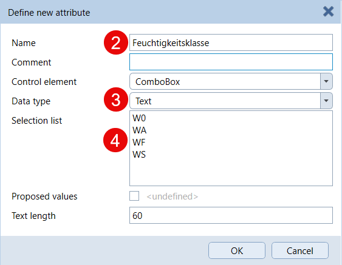
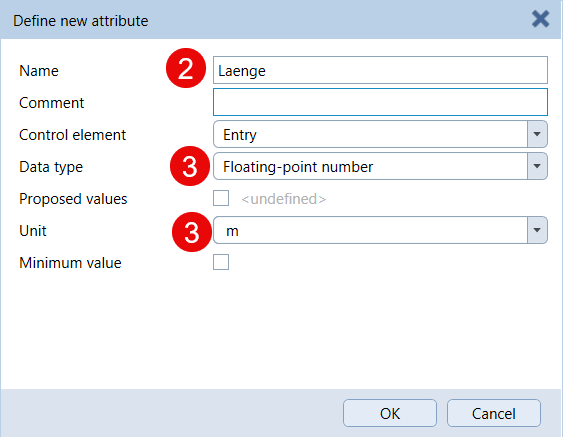 

### for the assignment

in the rows marked as **Element** in the column **Typ** the relvant value of the identifyer attribute is listed in the **Name** column. The properties listed in the following **Eigenschaft** rows will be assigned to all objects that have been classified accordingly. The ALLPLAn attribute used as identyfier is freeof choice

 

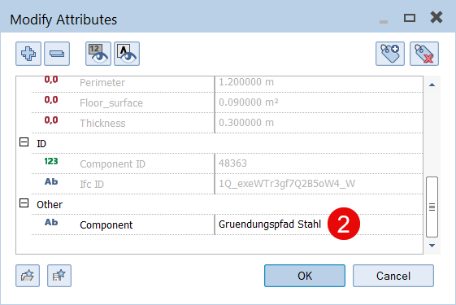
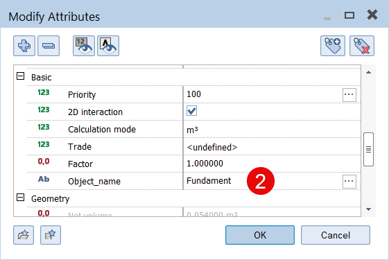 

### regarding the mapping table

the particular **PSet** in which the following **Eigenschaften** are combined during IFC export is determined in the rows marked as **Gruppe** in the **Typ** column wheras attribute name and attribute type remain constant.

The mapping can either be general for all objects or customized for a special **IfcEntity**, dependent upon the value in the **IFC 4 Add2** column. If it contains a speccial class (like IfcPipe or IfcFooting) this will be taken into account, if it contains **IfcBuildingElementProxy** it will be considered as a general mapping.

 

 

## Workflow

In general, all installed PythonParts can be found in the Library palette, no matter if an additional ActionBar entry is created or not. They are started either with a **double-click** on the icon or per **Drag and Drop** into the viewport. This shows the corresponding Properties palette and executes the underlying skripts.

Similar to the single steps the palette is also divided into the different parts
- definition
- assignment
- mapping

and one part named **General settings**. It is relevant for all steps and serves to **read** the **Excel table** and to determin the current **phase** and **trade** that should be considered.

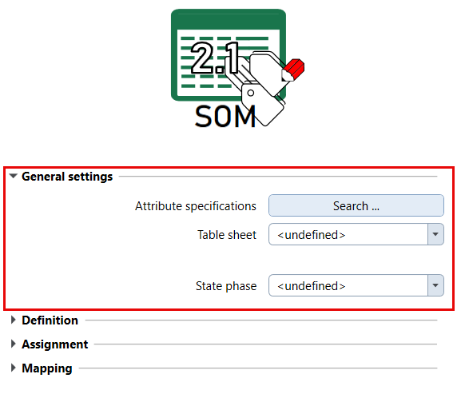 

> ⚠️IMPORTANT\
Generally speaking, the individual steps are independend and it is not necessary to execute them consectutive in one go. However the **definition** and **creation of attributes** is a mandatory precondition to **assign** or **mapp** them afterwards. Therfor it is always the first workflow step.

Prior to **assign** attributes to the model objects they have to be provided with the choosen **Identifyer attribute** and the suitable **Identifyer value** (element name). Clicking the Objects **select** button opens the general selection dialog in ALLPLAN which also provides options for filtering or area input. The assignment as such is startet afterward with the button named accordingly.

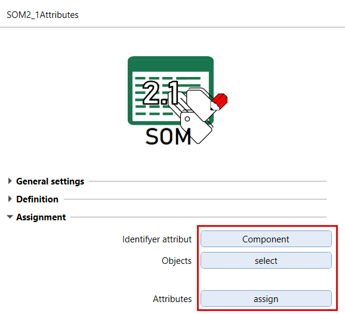 